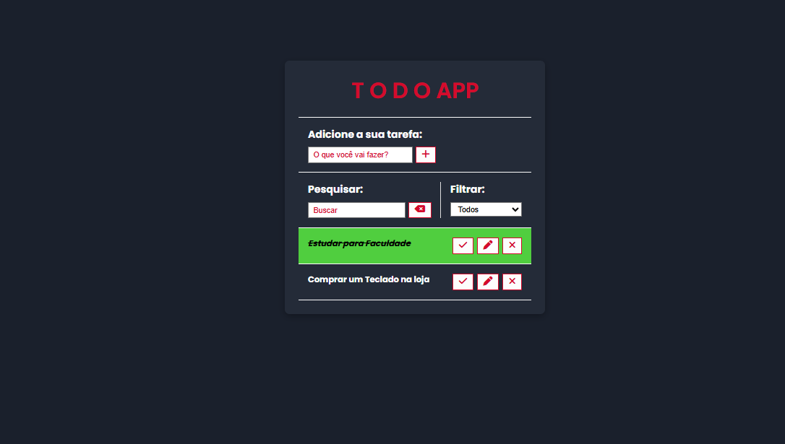

# 📝 To Do App

Este é um aplicativo de tarefas simples, elegante e funcional, desenvolvido com HTML, CSS e JavaScript. Ele permite adicionar, editar, marcar como concluídas, remover e filtrar tarefas com persistência local via `localStorage`.

## 🔍 Visão Geral

O objetivo do projeto é oferecer uma forma prática de organizar tarefas do dia a dia em uma interface intuitiva, responsiva e acessível.

---

## ✨ Funcionalidades

- ✅ Adicionar novas tarefas
- ✏️ Editar tarefas existentes
- ✔️ Marcar tarefas como concluídas
- 🗑️ Remover tarefas
- 🔍 Pesquisar por tarefas
- 🔃 Filtrar entre todas, feitas e a fazer
- 💾 Persistência de dados com `localStorage`
- 📱 Responsivo para dispositivos móveis

---

## 🛠️ Tecnologias Utilizadas

- **HTML5**  
- **CSS3** (com organização modular em `style.css`, `color.css`, `media.css`)  
- **JavaScript (Vanilla)**  
- **Font Awesome** para ícones  
- **LocalStorage** para persistência de dados  

---

